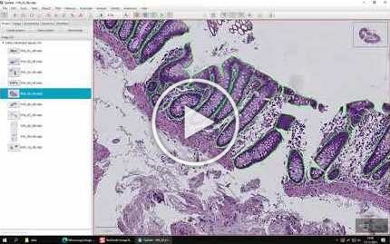

[](https://opensource.org/licenses/MIT)
[](https://www.frontiersin.org/articles/10.3389/fmed.2021.816281/full)
[]([https://youtu.be/WEgB4lAZyKM](https://www.youtube.com/watch?v=9dTfUwnL6zY))
[](https://doi.org/10.18710/TLA01U)


<p align="center">
  
</p>


# NoCodeSeg: Deep segmentation made easy!

⚠️***Latest: Generic multiclass support has been added to the pipeline!***

This is the official repository for the manuscript [*"Code-free development and deployment of deep segmentation models for digital pathology"*](https://www.frontiersin.org/articles/10.3389/fmed.2021.816281/full), **published** open access in Frontiers in Medicine.

The repository contains trained deep models for epithelium segmentation of HE and CD3 immunostained WSIs, as well as source code relevant for importing/exporting annotations/predictions in [QuPath](https://qupath.github.io/), both from [DeepMIB](http://mib.helsinki.fi/downloads.html) and [FastPathology](https://github.com/AICAN-Research/FAST-Pathology).

All relevant scripts for working with our pipeline can be found in the [source directory](https://github.com/andreped/NoCodeSeg/tree/main/source).

See [here](https://github.com/andreped/NoCodeSeg#models) for how to access the trained models.

See [here](https://github.com/andreped/NoCodeSeg#data) for how to download the 251 annotated WSIs.

## [Getting started](https://github.com/andreped/NoCodeSeg#getting-started)

[](https://youtu.be/9dTfUwnL6zY).

A video tutorial of the proposed pipeline was published on [YouTube](https://www.youtube.com/watch?v=9dTfUwnL6zY&ab_channel=HenrikSahlinPettersen).
It demonstrates the steps for: 
* Downloading and installing the software
* QuPath
  * Create a project, then export annotations as patches with label files
  * Export patches from unannotated images for prediction in DeepMIB
  * (later) Import predictions for MIB and FastPathology as annotations
* MIB
  * Use the annotated patches/labels exported from QuPath
  * Configuring and training deep segmentation models (i.e. U-Net/SegNet)
  * Use the trained U-Net to predict unannotated patches exported from QuPath
  * Export trained models into the ONNX format for use in FastPathology
* FastPathology
  * Importing and creating a configuration file for the DeepMIB exported ONNX model
  * Create a project and load WSIs into a project
  * Use the U-Net ONNX model to render predictions on top of the WSI in real time
  * Export full sized WSI tiffs for import into QuPath

Note that the version of FastPathology used in the demonstration was v0.2.0 (this exact version can be downloaded from [here](https://github.com/AICAN-Research/FAST-Pathology/releases/tag/v0.2.0)). The software is continuously in development, and features presented in the video are therefore prone to changes in the near future. To get information regarding changes and new releases, please, visit the [FastPathology repository](https://github.com/AICAN-Research/FAST-Pathology).

## [Data](https://github.com/andreped/NoCodeSeg#data)
The 251 annotated WSIs are made openly available for anyone on [DataverseNO](https://doi.org/10.18710/TLA01U). Alternatively, the data can be downloaded directly from Google Drive (click [here](https://drive.google.com/drive/folders/1eUVs1DA1UYayUYjr8_aY3O5xDgV1uLvH?usp=sharing) to access the dataset). Information on how to cite the IBDColEpi dataset can be found on [DataverseNO](https://doi.org/10.18710/TLA01U).

<details>
<summary>

### [Reading annotations](https://github.com/andreped/NoCodeSeg#reading-annotations)</summary>

The annotations are stored as tiled, pyramidal TIFFs, which makes it easy to generate patches from the data without the need for any preprocessing. Reading these files and working with them to generate training data, is already described in the [tutorial video](https://github.com/andreped/NoCodeSeg#getting-started) above.

TL;DR: Load TIFF as annotations in QuPath using provided [groovy script](https://github.com/andreped/NoCodeSeg/blob/main/source/importPyramidalTIFF.groovy) and [exporting](https://github.com/andreped/NoCodeSeg/blob/main/source/exportTiles.groovy) these as labelled tiles.
</details>

<details>
<summary>

### [Reading annotation in Python](https://github.com/andreped/NoCodeSeg#reading-annotation-in-python)</summary>

However, if you wish to use Python, the annotations can be read exactly the same way as regular WSIs (for instance using [OpenSlide](https://pypi.org/project/openslide-python/)):
```
import openslide

reader = ops.OpenSlide("path-to-annotation-image.tiff")
patch = reader.read_region(location=(x, y), level, size=(w, h))
reader.close()
```

Pixels here will be one-to-one with the original WSI. To generate patches for training, it is also possible to use [pyFAST](https://pypi.org/project/pyFAST/), which does the patching for you. For an example see [here](https://fast.eriksmistad.no/python-tutorial-wsi.html#autotoc_md133).
</details>

<details>
<summary>

### [Models](https://github.com/andreped/NoCodeSeg#models)</summary>

Note that the trained models can only be used for academic purposes due to MIB's license. Trained model files (.mibDeep for MIB and .onnx for FastPathology) are made openly available on [Google Drive](https://drive.google.com/drive/folders/1eUVs1DA1UYayUYjr8_aY3O5xDgV1uLvH). Simply download the file "trained-models.zip" and uncompress to get access the respective files.
</details>

## [Applications of pipeline](https://github.com/andreped/NoCodeSeg#applications-of-pipeline)
* Røyset et al., Deep learning-based image analysis reveals significant differences in the number and distribution of mucosal CD3 and γδ T cells between Crohn's disease and ulcerative colitis, The Journal of Pathology, https://doi.org/10.1002/cjp2.301
* Pettersen et al., Code-free development and deployment of deep segmentation models for digital pathology (2022), Frontiers in Medicine, https://doi.org/10.3389/fmed.2021.816281

## [How to cite](https://github.com/andreped/NoCodeSeg#how-to-cite)
Please, consider citing our paper, if you find the work useful:
<pre>
  @article{10.3389/fmed.2021.816281,
  author={Pettersen, Henrik Sahlin and Belevich, Ilya and Røyset, Elin Synnøve and Smistad, Erik and Simpson, Melanie Rae and Jokitalo, Eija and Reinertsen, Ingerid and Bakke, Ingunn and Pedersen, André},   
  title={Code-Free Development and Deployment of Deep Segmentation Models for Digital Pathology},      
  journal={Frontiers in Medicine},      
  volume={8},      
  year={2022},      
  url={https://www.frontiersin.org/article/10.3389/fmed.2021.816281},       
  doi={10.3389/fmed.2021.816281},      
  issn={2296-858X}}
</pre>

In addition, if you used the data set in your work, please, cite the following:
<pre>
  @data{TLA01U_2021,
  author = {Pettersen, Henrik Sahlin and Belevich, Ilya and Røyset, Elin Synnøve and Smistad, Erik and Jokitalo, Eija and Reinertsen, Ingerid and Bakke, Ingunn and Pedersen, André},
  publisher = {DataverseNO},
  title = {{140 HE and 111 CD3-stained colon biopsies of active and inactivate inflammatory bowel disease with epithelium annotated: the IBDColEpi dataset}},
  year = {2021},
  version = {V2},
  doi = {10.18710/TLA01U},
  url = {https://doi.org/10.18710/TLA01U}}
</pre>

## [Acknowledgements](https://github.com/andreped/NoCodeSeg#acknowledgements)
We wish to give our praise to [Peter Bankhead](https://www.ed.ac.uk/pathology/people/staff-students/peter-bankhead) and the [QuPath](https://github.com/qupath/qupath) team for their continuous support and assistance with QuPath and for assisting us in developing the scripts related to this study.
